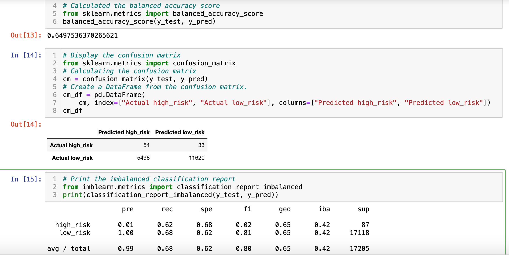
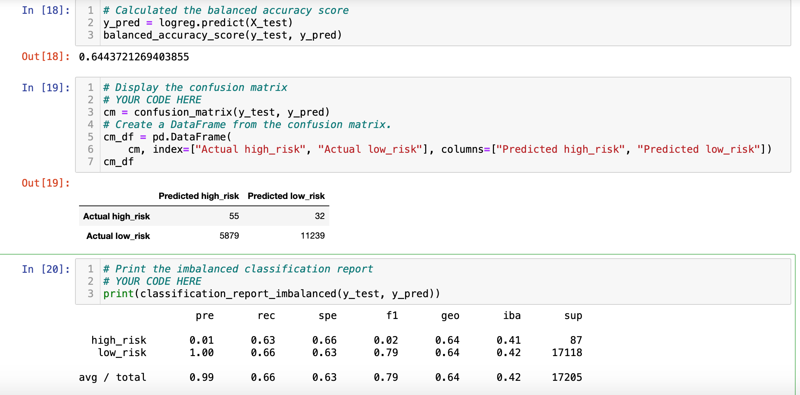
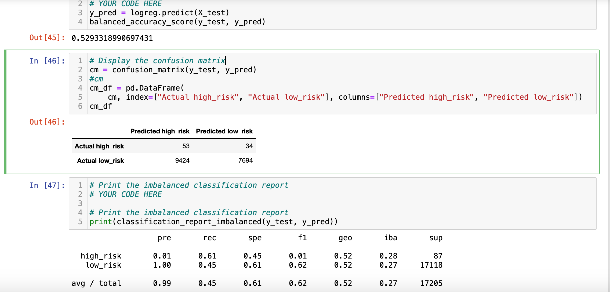
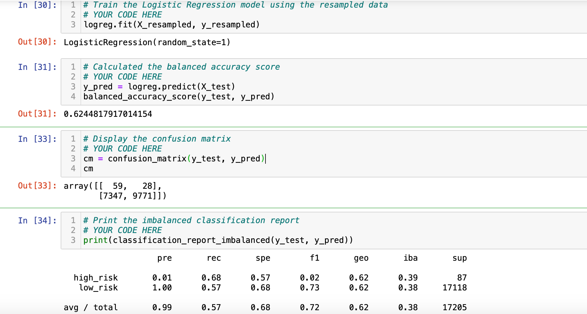
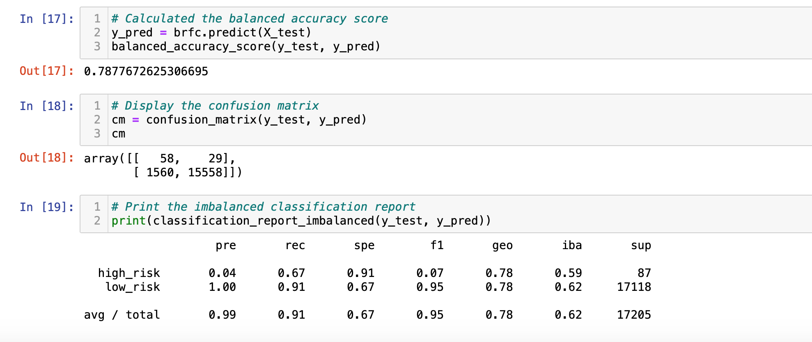
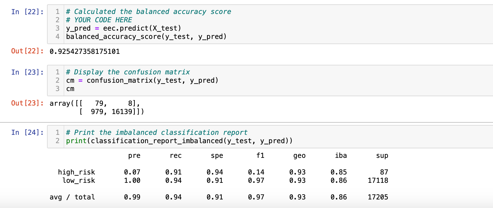

# Credit_Risk_Analysis

## Overview of the Analysis
---
Applied machine learning to solve a real-world challenge:`credit card risk`. Credit risk is an inherently unbalanced classification problem, as good loans easily outnumber risky loans.
Employed different techniques to train and evaluate models with unbalanced classes:
- Oversample the data using the `RandomOverSampler` and `SMOTE` algorithms
- Undersample the data using the `ClusterCentroids` algorithm
- Used a combinatorial approach of over- and undersampling using the `SMOTEENN` algorithm
- Compared two new machine learning models that reduce bias, `BalancedRandomForestClassifier` and `EasyEnsembleClassifier` to predict credit risk

Evaluated the performance of these models and made a written recommendation on whether they should be used to predict credit risk

## Result
---
- RandomOverSampler:

    - The balanced accuracy score is about 65%
    - High Risk Precision is 1% with a sensitivity of 62%
    - Low Risk Precision is 100% with a sensitivity of 68%

- SMOTE:

    - The balanced accuracy is 64%
    - High Risk Precision is 1% with a sensitivity of 63%
    - Low Risk Precision is 100% with a sensitivity of 66%

- ClusterCentroids:

    - The balanced accuracy is down to approx 52%
    - High Risk Precision is 1% with a sensitivity of 61%
    - Low Risk Precision is 100% with a sensitivity of 45%

- SMOTEENN:

    - The balanced accuracy is 62%
    - High Risk Precision is 1% with a sensitivity of 68%
    - Low Risk Precision is 100% with a sensitivity of 57%

- BalancedRandomForest:

    - The balanced accuracy is about 78%
    - High Risk Precision is 4% with a sensitivity of 67%
    - Due to lower number of false positives,Low Risk Precision is 100% with a sensitivity of 91%

- EasyEnsembleAdaBoostClassifier:

    - The balanced accuracy is now 92%
    - High Risk Precision is 7% with a sensitivity of 91%
    - Due to lower number of false positives,Low Risk Precision is 100% with a sensitivity of 94%

## Summary
---
- The `EasyEnsembleAdaBoostClassifier` model shows a recall of 92%, it detects all high risk credit. 
- Alternately, with a low precision, a lot of low risk credits are still falsely detected as high risk 
- For the reasons above, would not recommend the bank to use any of the above models to predict credit risk